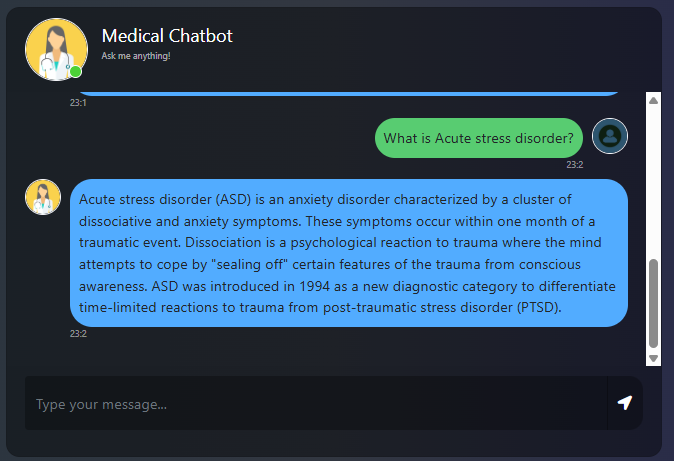
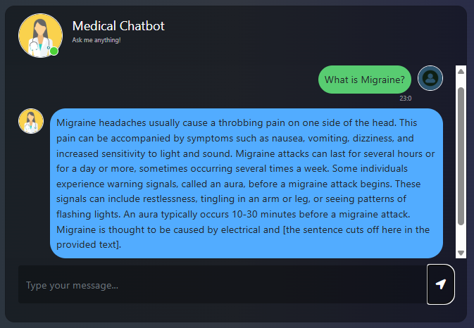

# 🏥 MedAI Chatbot: AI-Powered Medical Knowledge Assistant

A **Medical Chatbot** powered by **LLM (Gemini 2.5 Flash)** and a **custom medical knowledge base** built from *The Gale Encyclopedia of Medicine*. Users can query the chatbot to get reliable medical information from a structured PDF dataset.

This project leverages **vector embeddings**, **Pinecone**, and **LangChain** to create a knowledge retrieval system, combined with **Flask** and a **Bootstrap frontend** for interactive chat.

---

  
*MedAI Chatbot interface response sample 1*

  
*MedAI Chatbot interface response sample 2*

## 🔹 Features

* Retrieves medical information from *The Gale Encyclopedia of Medicine*.
* Embeds text chunks into a **vector database** using Hugging Face embeddings.
* Uses **Gemini 2.5 Flash LLM** for context-aware responses.
* Ranks relevant knowledge base results for precise answers.
* Simple web interface using **Bootstrap** (template-based, easily customizable).
* Supports dynamic updates by adding new PDFs to the dataset.

---

## 🛠️ Project Structure

```
Medical-Chatbot/
│
├─ Data/                   # Directory containing PDF files
├─ src/
│  ├─ __init__.py
│  ├─ helper.py            # Functions for PDF loading, text splitting, embeddings
│  └─ prompt.py            # System prompts for LLM
├─ research/
│  └─ trials.ipynb         # Optional Jupyter Notebook experiments
├─ app.py                  # Flask web app
├─ store_index.py          # Script to create Pinecone index from PDF data
├─ template.py             # Boilerplate template for project structure
├─ setup.py                # Project setup
├─ requirements.txt        # Required Python packages
└─ .env                    # Environment variables (API keys)
```

---

## ⚡ Requirements

* Python 3.10+
* Packages (from `requirements.txt`):

```text
sentence-transformers==2.2.2
langchain
flask
pypdf
python-dotenv
pinecone-client[grpc]
langchain-pinecone
langchain-community
langchain-openai
langchain-experimental
-e .
```

---

## 🛠️ Installation

1. **Clone the repository**:

```bash
git clone https://github.com/yourusername/medical-chatbot.git
cd medical-chatbot
```

2. **Create a virtual environment**:

```bash
python -m venv venv
source venv/bin/activate       # Linux/macOS
venv\Scripts\activate          # Windows
```

3. **Install dependencies**:

```bash
pip install -r requirements.txt
```

4. **Set up environment variables** in `.env`:

```env
PINECONE_API_KEY=your_pinecone_api_key
OPENAI_API_KEY=your_openai_api_key
GEMINI_API_KEY=your_google_gemini_api_key
```

---

## 📦 How It Works

### 1️⃣ Data Preparation

* PDFs are loaded from the `Data/` folder.
* Each PDF is split into **chunks** for better embedding coverage.
* Hugging Face embeddings are generated for each chunk.

```python
from src.helper import load_pdf_file, text_split, download_hugging_face_embeddings

extracted_data = load_pdf_file(data='Data/')
text_chunks = text_split(extracted_data)
embeddings = download_hugging_face_embeddings()
```

---

### 2️⃣ Pinecone Vector Database

* Initializes a Pinecone client.
* Creates an index if it doesn’t exist.
* Stores text chunk embeddings in the index.

```python
from pinecone import Pinecone, ServerlessSpec
from langchain_pinecone import PineconeVectorStore

pc = Pinecone(api_key=PINECONE_API_KEY)
index_name = "medibot"

if not pc.has_index(index_name):
    pc.create_index(name=index_name, dimension=384, metric="cosine",
                    spec=ServerlessSpec(cloud="aws", region="us-east-1"))

docsearch = PineconeVectorStore.from_documents(
    documents=text_chunks,
    index_name=index_name,
    embedding=embeddings
)
```

---

### 3️⃣ Querying the Chatbot

* User query → converted to embedding → retrieved top relevant chunks from Pinecone → LLM generates response.

```python
from langchain_google_genai import ChatGoogleGenerativeAI
from langchain.chains import create_retrieval_chain, create_stuff_documents_chain
from src.prompt import system_prompt
from langchain_core.prompts import ChatPromptTemplate

retriever = docsearch.as_retriever(search_type="similarity", search_kwargs={"k":3})
llm = ChatGoogleGenerativeAI(model="gemini-2.5-flash", google_api_key=GEMINI_API_KEY)

prompt = ChatPromptTemplate.from_messages([
    ("system", system_prompt),
    ("human", "{input}")
])

qa_chain = create_stuff_documents_chain(llm, prompt)
reg_chain = create_retrieval_chain(retriever, qa_chain)

response = reg_chain.invoke({"input": "What is diabetes?"})
```

---

### 4️⃣ Web Interface

* **Flask** serves a simple chat UI (`chat.html`).
* Users send queries → Flask route processes → LLM response returned.

```python
@app.route("/get", methods=["POST"])
def chat():
    msg = request.form.get("msg")
    response = reg_chain.invoke({"input": msg})
    return str(response["answer"])
```

---

## 💡 System Prompt

```text
You are a knowledgeable assistant designed to answer questions using the provided context. 
Carefully consider the information in the context to generate your response. 
If the answer is not available in the context, clearly state that you do not know.

{context}
```

---

## ⚙️ How to Run

1. **Build the Pinecone index**:

```bash
python store_index.py
```

2. **Run the Flask app**:

```bash
python app.py
```

3. Open your browser and navigate to:

```
http://localhost:8080
```

---

## 🧩 Technologies Used

* **LLM**: Google Gemini 2.5 Flash
* **Vector DB**: Pinecone
* **Embeddings**: Hugging Face `sentence-transformers/all-MiniLM-L6-v2`
* **Framework**: Flask
* **Frontend**: Bootstrap
* **Document Loading & Splitting**: LangChain

---

## ✅ Future Improvements

* Add **multi-document support** with metadata.
* Support **context-aware conversation history**.
* Add **fine-grained medical filters** for safer responses.
* Deploy as a **cloud app** with persistent Pinecone vector DB.

---

## 📄 References

* [Pinecone Vector Database](https://www.pinecone.io/)
* [LangChain Documentation](https://www.langchain.com/docs/)
* [Hugging Face Embeddings](https://huggingface.co/sentence-transformers)
* [Gemini AI](https://developers.google.com/learn/ai)